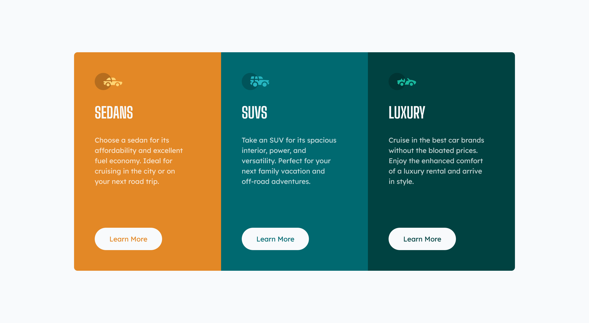

# Frontend Mentor - 3-column preview card component solution

This is a solution to the [3-column preview card component challenge on Frontend Mentor](https://www.frontendmentor.io/challenges/3column-preview-card-component-pH92eAR2-). Frontend Mentor challenges help you improve your coding skills by building realistic projects. 

## Table of contents

- [Overview](#overview)
  - [The challenge](#the-challenge)
  - [Screenshot](#screenshot)
  - [Links](#links)
- [My process](#my-process)
  - [Built with](#built-with)
  - [What I learned](#what-i-learned)
  - [Continued development](#continued-development)
- [Author](#author)

**Note: Delete this note and update the table of contents based on what sections you keep.**

## Overview

### The challenge

Users should be able to:

- View the optimal layout depending on their device's screen size
- See hover states for interactive elements

### Screenshot

### Links

- Solution URL: (https://github.com/djbedford/fm-3-column-preview-card)
- Live Site URL: (https://spectacular-unicorn-d4521c.netlify.app)

## My process

### Built with

- Semantic HTML5 markup
- CSS Grid
- Mobile-first workflow
- [Tailwind CSS](https://tailwindcss.com/) - A utility-first CSS framework

### What I learned

During the implementation of this solution I continued to build my knowledge of CSS grid and Tailwind CSS

### Continued development

My focus will be to continue building my experience designing layouts with CSS grid.

## Author

- Frontend Mentor - [@djbedford](https://www.frontendmentor.io/profile/djbedford)
- Twitter - [@djbedford](https://www.twitter.com/djbedford)
